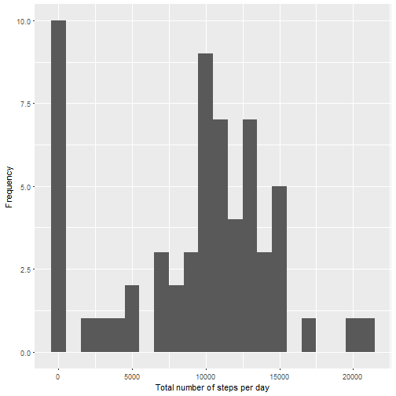
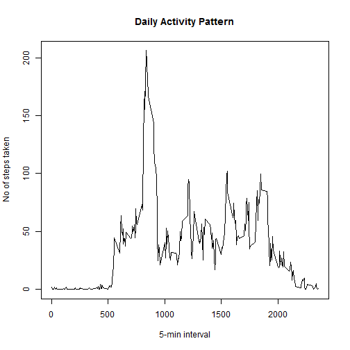
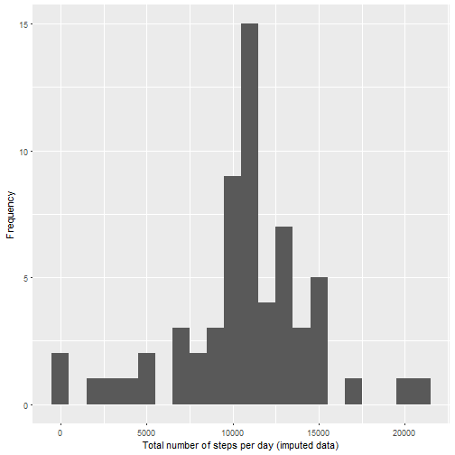
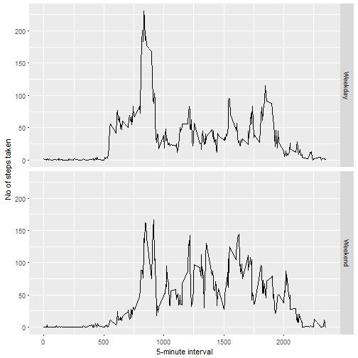

# Reproducible Research: Course Project 1


### Loading and preprocessing the data

```r
url <- "https://d396qusza40orc.cloudfront.net/repdata%2Fdata%2Factivity.zip"
download.file(url, "data.zip")
unzip("data.zip")
data <- read.csv("activity.csv")
file.remove("data.zip")
```

```
## [1] TRUE
```

### What is mean total number of steps taken per day?

```r
total.steps <- tapply(data$steps, data$date, FUN = sum, na.rm = TRUE)
library(ggplot2)
qplot(total.steps, 
      binwidth = 1000, 
      xlab = "Total number of steps per day", 
      ylab = "Frequency")
```



```r
mean(total.steps, na.rm = TRUE)
```

```
## [1] 9354.23
```

```r
median(total.steps, na.rm = TRUE)
```

```
## [1] 10395
```

### What is the average daily activity pattern?

```r
mean.steps <- aggregate(x = list(steps = data$steps),
                        by = list(interval = data$interval),
                        FUN = mean, na.rm = TRUE)
plot(mean.steps$interval, 
     mean.steps$steps, 
     type = "l", 
     ylab = "No of steps taken", 
     xlab = "5-min interval", 
     main = "Daily Activity Pattern")
```



Which 5-minute interval, on average across all the days in the dataset, contains the maximum number of steps?

```r
mean.steps[which.max(mean.steps$steps),]
```

```
##     interval    steps
## 104      835 206.1698
```

### Imputing missing values

There are a number of days/intervals where there are missing values (coded as NA). The presence of missing days may introduce bias into some calculations or summaries of the data.

Total number of missing values in the dataset (i.e. the total number of rows with NA)

```r
sum(is.na(data$steps))
```

```
## [1] 2304
```

I choose to fill in missing values with the median value of 5-min interval to produce the new data set

```r
fill.value <- function(steps, interval) {
    filled <- NA
    if (!is.na(steps))
        filled <- c(steps)
    else
        filled <- (mean.steps[mean.steps$interval == interval, "steps"])
    return(filled)
}
newdata <- data
newdata$steps <- mapply(fill.value, newdata$steps, newdata$interval)
```

Histogram of the total number of steps taken each day and calculate the mean and median total number of steps with the new data.

```r
total.steps <- tapply(newdata$steps, newdata$date, FUN = sum, na.rm = TRUE)
library(ggplot2)
qplot(total.steps, 
      binwidth = 1000, 
      xlab = "Total number of steps per day (imputed data)", 
      ylab = "Frequency")
```



```r
mean(total.steps, na.rm = TRUE)
```

```
## [1] 10766.19
```

```r
median(total.steps, na.rm = TRUE)
```

```
## [1] 10766.19
```

#### Are there differences in activity patterns between weekdays and weekends?

```r
newdata$date <- as.Date(newdata$date)
newdata$dayname <- weekdays(newdata$date)
newdata$weekend <- as.factor(ifelse(newdata$dayname == "Saturday" | newdata$dayname == "Sunday", "Weekend", "Weekday"))
library(ggplot2)
mean.steps <- aggregate(steps ~ interval + weekend, data = newdata, mean)
ggplot(mean.steps, aes(interval, steps)) + geom_line() + facet_grid(weekend ~ .) + xlab("5-minute interval") + ylab("No of steps taken")
```


